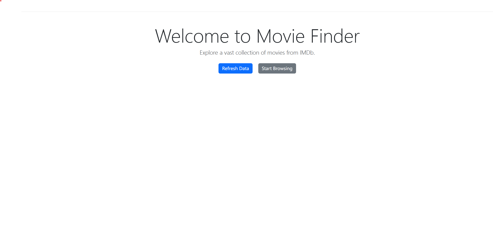
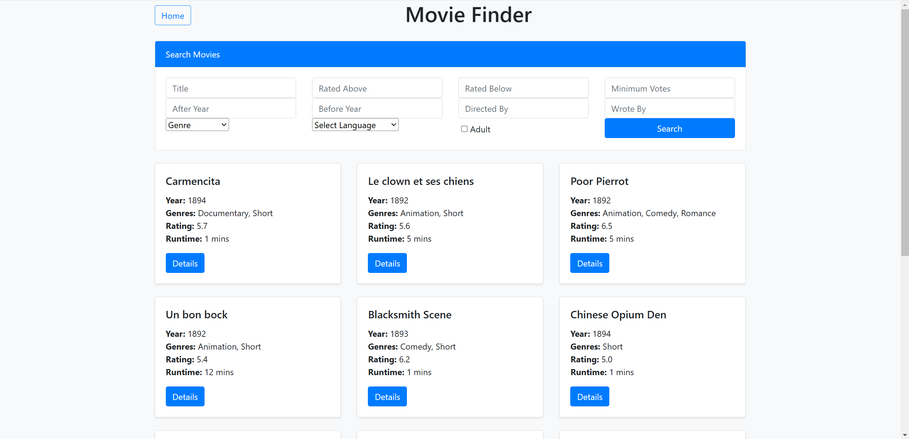
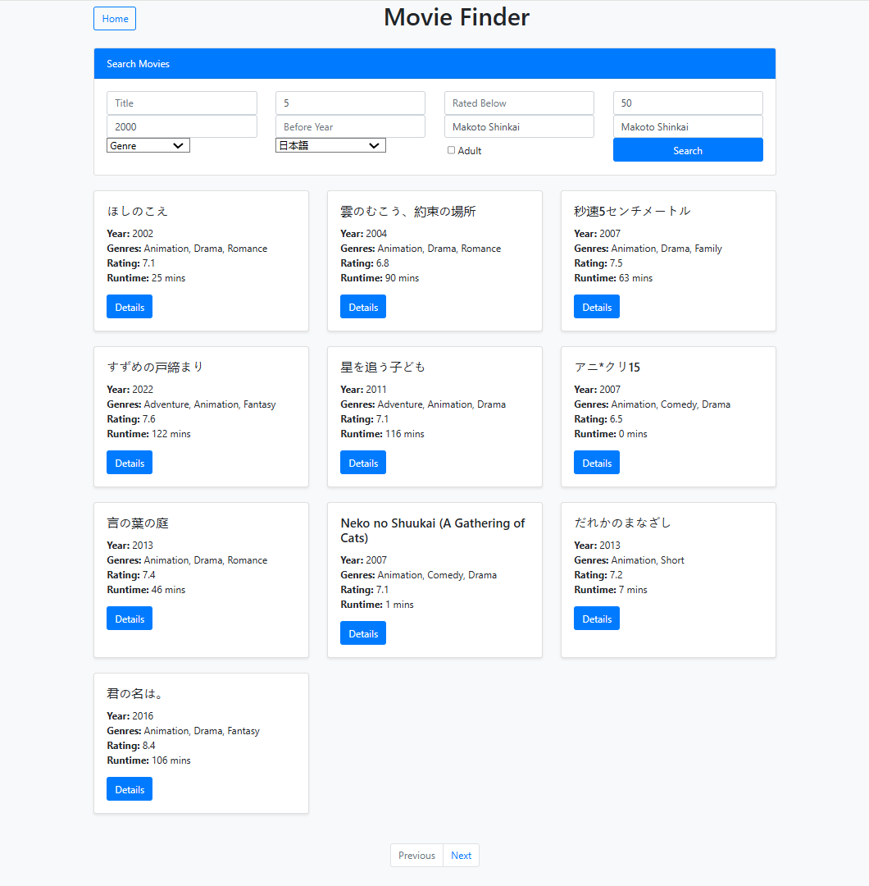
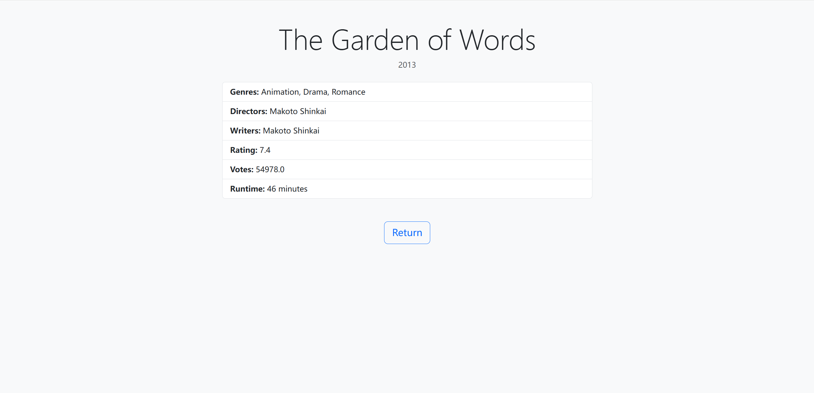

# Movie Finder

Movie Finder is a web application designed to provide users with an easy-to-use interface for searching and exploring IMDb movie data. 

## Features
- Search for movies by applying multiple filters simultaneously.
- View detailed information about a movie, including title, directors, writers, genres, and ratings.
- Refresh the movie database from IMDb Non-Commercial Datasets directly from the application interface.

## Queries Supported
You can search for movies using the following filters:
- **Title**: Search for movies by name.
- **Year**: Specify a range using "After Year" and "Before Year".
- **Rating**: Set minimum and/or maximum IMDb ratings.
- **Votes**: Specify the minimum number of votes.
- **Director**: Filter by director's name.
- **Writer**: Filter by writer's name.
- **Genre**: Select a specific genre.
- **Language**: Translate the title of movies into the selected language.
- **Adult**: Include or exclude adult content.

**Note**: Multiple filters can be applied simultaneously to narrow down your search results.

## Setup Instructions
To set up and run the application, follow these steps:
1. Install [Docker](https://www.docker.com/).
2. Clone the repository containing this project to your local machine.
3. Navigate to the project directory in your terminal.
4. Run the following command to start the application:

```bash
docker-compose up
```

5. Open your browser and navigate to `http://localhost:5000` to use the application.

## Usage
1. **Homepage**:

- Landing page with
- A button to refresh data (see sections below)
- And another to start browsing the movies.

2. **Search Page**:

- Use the filters in the search box to find movies.
- Translate movie titles into the selected language. Default title will be shown when a localized title is not available.
- Toggle adult mode with a checkbox.
- Results are displayed below the search box, with pagination enabled for 10 results per page.
- Blank filters will not be applied.
- A typical search result with title translation looks like the following:


3. **Movie Details Page**:
- View detailed information about a specific movie.
- A typical details page looks like the following:


## Database Schema

### 1. `name_basics` Collection
- **Data Source**: `name.basics.tsv`
- **Schema**:
  - **nconst** (string, indexed): Unique identifier for the person.
  - **primaryName** (string): Name of the person.
  - **birthYear** (integer): Year of birth (0 if unknown).
  - **deathYear** (integer): Year of death (0 if unknown).
  - **primaryProfession** (array): List of professions.
  - **knownForTitles** (array): List of titles the person is known for.

---

### 2. `akas` Collection
- **Data Source**: `title.akas.tsv`
- **Schema**:
  - **titleId** (string, indexed): Unique identifier for the title. (**tconst** as in `titles` Collection)
  - **title** (string): Localized title.
  - **region** (string, indexed): Region code for this version of the title.
  - **language** (string, indexed): Language of the title.
  - **isOriginalTitle** (boolean): Indicates if the title is the original version.

---

### 3. `titles` Collection
- **Data Source**: `title.basics.tsv`, `title.crew.tsv`, `title.ratings.tsv`
- **Schema**:
  - **tconst** (string, unique index): Unique identifier for the title.
  - **titleType** (string): Type of the title (e.g., movie, tvSeries).
  - **primaryTitle** (string): Popular/promotional title.
  - **originalTitle** (string): Original language title.
  - **isAdult** (boolean): Indicates if the content is adult-oriented.
  - **startYear** (integer): Year of release/start (0 if unknown).
  - **endYear** (integer): Year of series end (0 if unknown).
  - **runtimeMinutes** (integer): Runtime in minutes (0 if unknown).
  - **genres** (array): List of genres.
  - **directors** (array): List of director identifiers (`nconst`).
  - **writers** (array): List of writer identifiers (`nconst`).
  - **averageRating** (float): Weighted average user rating.
  - **numVotes** (integer): Number of user votes.

## Refreshing Data
- The "Refresh Data" button on the homepage triggers scripts to update the movie database with the latest data from IMDb. Refreshing is required for initial setup on each machine. 
- Dataset source files are saved under `/data` folder and can be safely removed after refreshing is complete.
- Refreshing data takes about 30 minutes and requires an internet connection.

## Lowest Hardware Requirement
- At least 64GB of RAM. Designate 48GB of RAM  to WSL 2 backend on Windows is recommended. This software has not been tested on macOS and is not guaranteed to work on machines with less than 64GB of RAM.
- If your system does not have 64GB of RAM available, a pre-imported database can be found [here](https://drive.google.com/file/d/1YWueineA9v5Ft8fokzDLbFcYuIHOCc_Q/view?usp=sharing). To use it:
  - Unzip the `mongo_data.zip` file.
  - Place the extracted `mongo_db` folder under the root directory of the project.
  - This will allow you to skip the data import process and use the preloaded database. 
  - With the pre-imported database, the system requires only 32GB of RAM.

## Data Source
The data used in this project is sourced from the [IMDb Non-Commercial Datasets](https://developer.imdb.com/non-commercial-datasets/).

## Generative AI Usage Disclosure
ChatGPT was used in the development of this project for both coding and documentation. 